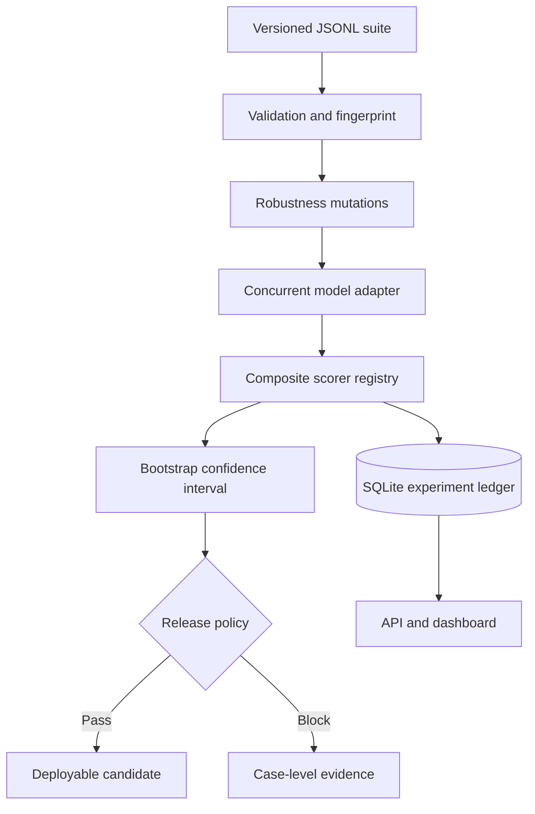

# Sentinel Eval Harness

Sentinel is a production-oriented evaluation and release-gating system for LLM and agent applications. It turns a versioned dataset into reproducible evidence that a new prompt, model, retrieval strategy, or agent implementation is safe to release.

This is not a wrapper around a single model call. It combines case-level scoring, adversarial mutations, experiment history, statistical uncertainty, operational budgets, and CI enforcement in one inspectable system.

## Why this project exists

Generative systems are non-deterministic. A change can improve average answer quality while silently breaking a high-risk segment, increasing latency, or weakening refusal behavior. Conventional unit tests cannot express all of those conditions, while manual spot checks cannot reliably detect regressions.

Modern evaluation platforms converge on several important patterns: datasets built from curated examples and production traces, multiple evaluator types, experiment comparison, trace evaluation, and continuous monitoring. Sentinel implements the engineering core of that workflow as a portable, open repository that can run without a paid evaluation platform.

## What makes Sentinel advanced

- **Reproducible datasets:** JSONL suites are validated, deduplicated by case ID, and content-addressed with a stable fingerprint.
- **Composite evaluation:** exact-match, required-term, refusal, latency, grounding, and reference-quality scorers run together.
- **Robustness probes:** deterministic input-noise and context-distractor mutations test invariance beyond the golden set.
- **Statistical evidence:** pass rates include a seeded 95% bootstrap confidence interval rather than presenting a point estimate alone.
- **Release gates:** CI fails when absolute quality falls below policy or when quality regresses beyond an allowed delta.
- **Failure isolation:** an endpoint failure is recorded on its case instead of destroying the entire experiment.
- **Operational metrics:** latency, token usage, and cost fields live beside quality metrics.
- **Trace-ready records:** adapters return structured execution events for agent-step and tool-use analysis.
- **Experiment ledger:** SQLite stores immutable run summaries and case-level evidence.
- **Zero-cost mode:** the deterministic fixture adapter exercises the entire platform in local development and CI.
- **Real-model mode:** an OpenAI-compatible HTTP adapter can evaluate hosted or local models without coupling the harness to one vendor.
- **Quality dashboard:** the included FastAPI application exposes run history and a responsive experiment view.

## Architecture



## Repository map

```text
src/eval_harness/
├── adapters/          # Fixture and OpenAI-compatible HTTP targets
├── scorers/           # Deterministic and offline quality scorers
├── api.py             # Run-history API and dashboard server
├── cli.py             # Evaluation command line interface
├── dataset.py         # Validation and dataset fingerprinting
├── models.py          # Typed evaluation contracts
├── mutations.py       # Adversarial robustness probes
├── runner.py          # Concurrent execution and release policy
├── statistics.py      # Seeded bootstrap intervals
└── storage.py         # SQLite experiment ledger
datasets/              # Version-controlled golden suites
dashboard/             # Dependency-free quality dashboard
tests/                 # Unit and integration tests
.github/workflows/     # Pull-request evaluation gate
```

## Quick start

Requires Python 3.11 or newer.

```bash
python -m venv .venv
source .venv/bin/activate
pip install -e '.[dev]'
pytest
sentinel-eval run datasets/product_support.jsonl --mutations
```

The command writes a full report to `artifacts/latest-run.json`, persists the experiment in `.sentinel/runs.db`, prints the release decision, and exits with code `2` if the gate fails.

Start the local dashboard:

```bash
uvicorn eval_harness.api:app --reload
```

Open `http://localhost:8000`.

## Evaluate a real model or agent endpoint

Sentinel accepts any OpenAI-compatible chat-completions endpoint:

```bash
export MODEL_ENDPOINT="https://your-endpoint.example/v1/chat/completions"
export MODEL_NAME="candidate-model"
export MODEL_API_KEY="your-key"

sentinel-eval run datasets/product_support.jsonl \
  --adapter http \
  --mutations \
  --min-pass-rate 0.90
```

Credentials are read only from the environment and are never stored in reports or the experiment database.

## Dataset contract

Each JSONL row describes one behavior the system must preserve:

```json
{
  "id": "billing-001",
  "input": "When will the annual plan refund arrive?",
  "expected": "Annual plan refunds arrive within 5 to 10 business days.",
  "context": ["Approved annual plan refunds arrive within 5 to 10 business days."],
  "tags": ["support", "billing"],
  "metadata": {
    "required_terms": ["5 to 10 business days"],
    "latency_budget_ms": 3000
  }
}
```

Production suites should combine:

1. Manually curated contractual behavior
2. Anonymized high-value production traces
3. Previously observed failures
4. Safety and policy boundary cases
5. Segment-specific edge cases
6. Synthetic variants reviewed by a human

## Release policy

The default example gate requires:

- At least an 80% total pass rate
- No more than a 2 percentage-point regression against the latest stored run
- All case-specific scorer thresholds to pass

Because aggregate quality can hide important failures, a production extension should add tag-level policies such as `safety = 100%` and minimum sample sizes for each product segment.

## CI behavior

Every pull request:

1. Lints the codebase
2. Runs the test suite with coverage
3. Executes the evaluation dataset with robustness mutations
4. Applies the release threshold
5. Uploads the complete evaluation report as an artifact, even on failure

This makes AI behavior part of the same review boundary as application code.

## Deployment

The included container runs an evaluation during image build and starts the FastAPI dashboard in production mode.

```bash
docker build -t sentinel-eval .
docker run --rm -p 8000:8000 sentinel-eval
```

It can be deployed to any container host. Persist `.sentinel/runs.db` on a volume for durable experiment history. For a multi-instance deployment, replace the SQLite store with Postgres while preserving the `RunStore` interface.

## Roadmap

- Calibrated LLM-as-judge scorer with blinded pairwise comparisons
- Human-review queue for low-confidence and evaluator-disagreement cases
- Agent goal-plan-action and tool-trajectory scorers
- Retrieval attribution and citation-entailment checks
- Slice metrics and drift alerts by tag, model, tenant, and prompt version
- OpenTelemetry trace ingestion
- Evaluation budget scheduler for production sampling
- Postgres-backed multi-user control plane

## Design references

- [OpenAI evaluation best practices](https://platform.openai.com/docs/guides/evals)
- [LangSmith evaluation concepts](https://docs.langchain.com/langsmith/evaluation-concepts)
- [MLflow production trace evaluation](https://mlflow.org/docs/latest/genai/eval-monitor/running-evaluation/traces/)
- [DeepEval](https://github.com/confident-ai/deepeval)

## License

MIT
